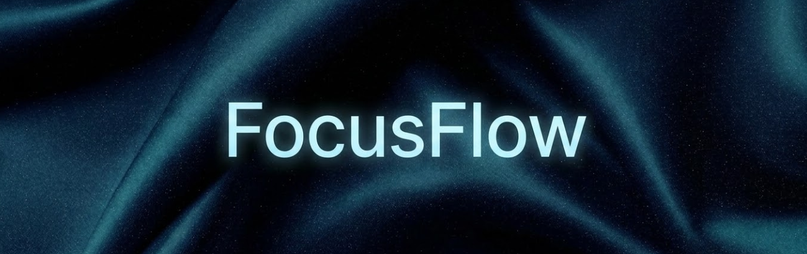

# FocusFlow 🌊

**FocusFlow** is a sophisticated browser companion designed to declutter your digital life. It empowers you to capture intensive browsing sessions and condense them into organized, high-tech "Workspaces". Wrapped in a premium Ocean Blue aesthetic with deep glassmorphism effects, FocusFlow turns tab management from a chore into a seamless, aesthetic experience.

## 🧠 The Why behind FocusFlow

We've all been there: a research rabbit hole, a complex coding problem, or a vacation planning session that ends with 50+ tabs open. Your browser becomes sluggish, your laptop fan starts screaming, and your mental focus shatters under the weight of visual clutter.

**FocusFlow was born to solve three core problems:**
1.  **Lowering Cognitive Load**: When you have too many tabs open, you spend more time searching for information than processing it. FocusFlow lets you "freeze" a context and clear your mind instantly.
2.  **RAM Efficiency**: Modern browsers are memory-hungry. By saving contexts and closing tabs, you reclaim system resources for the tasks that actually matter.
3.  **Context Switching**: Switching between different projects or moods (e.g., from Work to Gaming) is mentally taxing. FocusFlow provides a "save game" state for your browser, allowing you to resume exactly where you left off.



## ✨ Key Features
- **Context Saving**: Save all tabs in your current window into a single named "Workspace" and close them instantly to save RAM.
- **AI Auto-Grouping**: Uses **Groq Cloud AI** to analyze your tab titles and suggest concise, intelligent names for your workspaces.
- **One-Click Restore**: Reopen all saved tabs exactly where you left off, including scroll position.
- **Premium Design**: Modern Ocean Blue theme with status badges, high-tech toggles, and smooth micro-animations.
- **Privacy First**: Set your own Groq API key. No data leaves your machine except for the AI analysis you trigger.

## 🚀 Installation

1.  **Clone the repository**:
    ```bash
    git clone https://github.com/tamlight/FocusFlow.git
    ```
2.  **Open Browser Extensions**:
    - Go to `chrome://extensions/` (Chrome/Edge/Brave).
3.  **Enable Developer Mode**: Toggle the switch in the top right corner.
4.  **Load Unpacked**:
    - Click **Load unpacked** and select the `FocusFlow` folder.
5.  **Configure AI**:
    - Open the extension, enter your [Groq API Key](https://console.groq.com/keys) in the configuration section, and click **Save**.

## 🛠️ Built With
- **Vanilla JavaScript**: Pure, lightweight logic for maximum performance.
- **CSS3**: Custom design system with glassmorphism and animations.
- **Chrome Extension API**: Seamless tab and storage management.
- **Groq AI**: Lightning-fast Llama-3 inference for workspace categorization.

## 📄 License
MIT License. Feel free to use and modify for your own projects.
